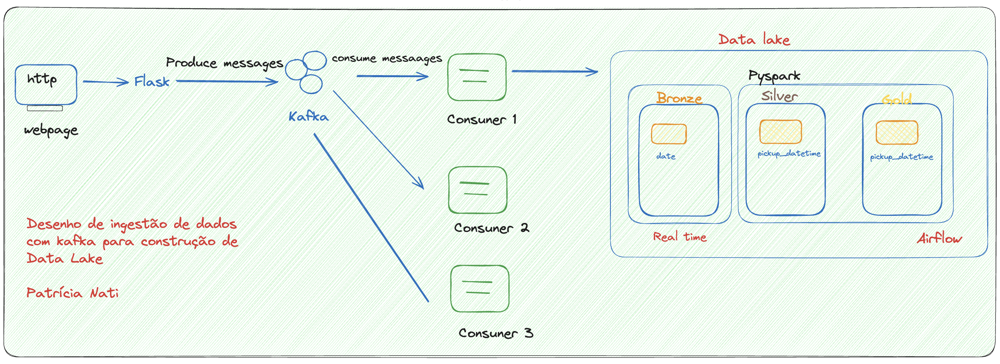
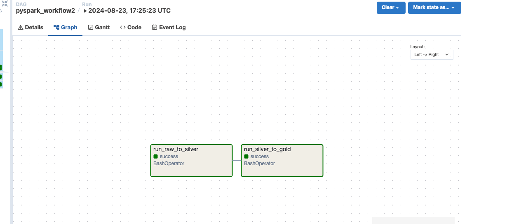

# Data Lake Pipeline



## Description

This repository contains a data pipeline for processing streaming data with Apache Kafka and PySpark. The pipeline consists of Kafka producers and consumers, and PySpark jobs that process data into different layers of a data lake. The workflow is orchestrated using Apache Airflow.

## Prerequisites

1. **Kafka and Zookeeper**

   Ensure Kafka and Zookeeper are running:

   ```bash
   zookeeper-server-start /opt/homebrew/etc/kafka/zookeeper.properties
   
   kafka-server-start /opt/homebrew/etc/kafka/server.properties

2. **Kafka Producer**

Start the Kafka producer:
    ```bash
    ~/dev/serasa/source/lake/producer/serasa_producer.py

3. **Kafka Consumer**

Start the Kafka consumer, which triggers every minute and writes data into a daily partition:
    ```bash
    ~/dev/serasa/source/lake/consumer/serasa_consumer.py

4. **Launch Airflow**
    ```bash
    docker-compose up --build
## PySpark Files

1-serasa_consumer.py: Consumes data from Kafka every minute and stores it in the raw area of the data lake.

2-raw_to_silver.py: Processes data from the raw area every day and transfers it to the silver layer.

3-silver_to_gold.py: Builds the business layer on a daily basis.

## Tests
There are 3 test files:

1-test_serasa_consumer.py
2-test_raw_to_silver.py
3-test_silver_to_gold.py

## Part 1: Generating New Records
To insert a new record into Kafka and generate a file in the raw area of the data lake:

    
    curl -v -X POST -H "Content-Type: application/json" \
    -d '[{"key": "1892-05-15 17:26:21.0000001","fare_amount": 4.5, "pickup_datetime": "2009-06-15 17:26:21 UTC", "pickup_longitude": -73.844311, "pickup_latitude": 40.721319, "dropoff_longitude": -73.84161, "dropoff_latitude": 40.712278, "passenger_count": 1}]' \
    http://localhost:5001/ingest

The consumer will identify the new messages and write a file in JSON format in the raw area of the data lake.

## Part 2: Running PySpark Processes

Two PySpark processes will run daily to generate the silver and gold layers in the data lake:

1-raw_to_silver.py: Transforms raw data to the silver layer.
2-silver_to_gold.py: Builds the gold layer.

These processes are orchestrated via Airflow installed on Docker.

